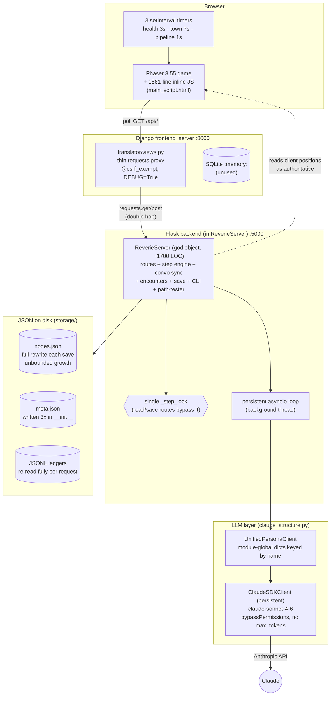
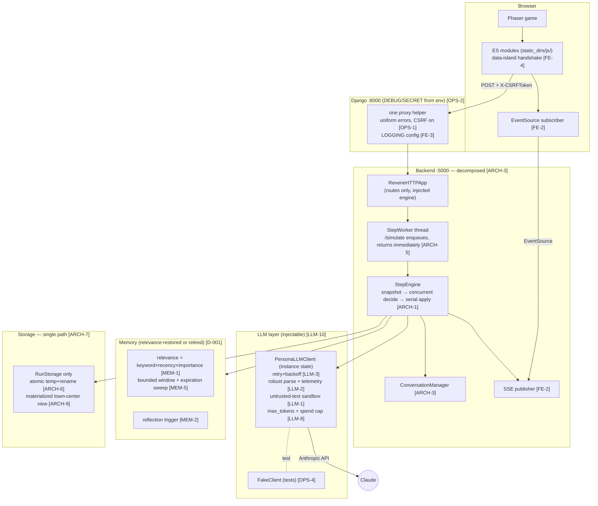
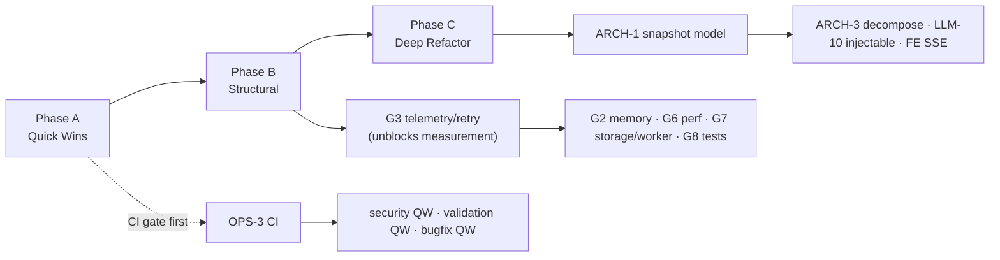

# Claudeville Improvement Pass — Technical Specification

- **Version:** 1.0 (2026-06-16)
- **Grounded in:** [PHASE-1-AUDIT.md](PHASE-1-AUDIT.md) · **Drives:** [PRD.md](PRD.md) goals G1–G9
- **Decisions referenced:** see [DECISIONS.md](DECISIONS.md) (D-001…D-006)
- **Diagrams:** Mermaid. Render in any Mermaid-aware viewer (GitHub, VS Code Mermaid preview).

---

## 1. Current architecture (as-is)

### 1.1 Component / deployment view



### 1.2 Simulation-step sequence (as-is) — showing the correctness hazards

```mermaid
sequenceDiagram
    participant FE as Frontend
    participant RS as ReverieServer
    participant Loop as asyncio loop
    participant P as Persona.move (xN concurrent)
    participant World as shared maze/personas_tile

    FE->>RS: POST /simulate (blocks request thread, holds _step_lock)
    RS->>World: overwrite tiles from client env (no validation) [ARCH-12]
    RS->>RS: sequential new-encounters
    RS->>Loop: gather(move() for all remaining personas) [ARCH-1]
    par concurrent, UNSYNCHRONIZED
        P->>World: read/mutate shared maze & tiles (race) [ARCH-1]
        P->>P: LLM call → greedy-regex parse → idle on any error [LLM-2]
    end
    Note over Loop: 15s batch timeout
    alt timeout
        Loop--xRS: future.cancel() (outer only)
        RS->>RS: fallback results, advance step/time
        P->>World: ABANDONED coroutines keep mutating next step [ARCH-2]
    end
    RS->>RS: _synchronize_conversations (340 LOC)
    RS->>Storage: save() non-atomic, CWD-relative [ARCH-6/7]
    FE->>RS: poll GET /movements (destructive pop) [ARCH-8]
```

### 1.3 As-is properties (the debt, in one place)

| Property | Current state | Finding |
|----------|---------------|---------|
| Step determinism | None (shared mutable state, `random.sample`) | ARCH-1, MEM-8 |
| Failure visibility | Silent idle on parse/API error | LLM-2 |
| Transport resilience | No retry/backoff | LLM-3 |
| Multi-agent safety | Verbatim text injection | LLM-1 |
| Memory fidelity | Recency-only; relevance/reflection dead | MEM-1, MEM-2 |
| Memory scaling | O(history) per step, full rewrite | MEM-5 |
| Pathfinding | O(W·H)/wave, silent failure | MEM-3 |
| Persistence | Non-atomic, two path systems | ARCH-6, ARCH-7 |
| Module boundaries | One 1700-LOC god object | ARCH-3 |
| Transport | 100% polling, no push | FE-2 |
| Security | CSRF off, hardcoded secrets, XSS | OPS-1, OPS-2, FE-6 |
| Quality gates | No CI, unpinned deps | OPS-3, OPS-5 |

---

## 2. Target architecture (to-be)

### 2.1 Component view (to-be)



### 2.2 Target simulation-step (to-be) — snapshot / decide / apply

```mermaid
sequenceDiagram
    participant FE as Frontend
    participant App as ReverieHTTPApp
    participant Wk as StepWorker
    participant Eng as StepEngine
    participant Snap as WorldSnapshot (immutable)
    participant P as Persona.decide (xN concurrent, read-only)

    FE->>App: POST /simulate
    App->>Wk: enqueue(steps); return {queued} immediately [ARCH-5]
    Wk->>Eng: run_step()
    Eng->>Snap: freeze world (positions, tile events) [ARCH-1]
    par concurrent, READ-ONLY over Snap
        P->>Snap: read only
        P->>P: LLM decide → robust parse → typed result/telemetry [LLM-2]
        Note over P: per-persona timeout inside coroutine [ARCH-2]
    end
    Eng->>Eng: collect intended mutations (return values)
    Eng->>Eng: apply mutations SERIALLY (deterministic order) [ARCH-1]
    Eng->>Eng: ConversationManager.sync()
    Eng->>RunStorage: atomic save [ARCH-6]
    Eng->>FE: SSE publish movements [FE-2]
```

### 2.3 Target properties (the metrics from PRD §4)

Each as-is row in §1.3 flips: deterministic steps, observable failures with retry, untrusted-text sandbox, relevance retrieval (or documented recency-only), bounded memory, O(V+E) pathfinding, atomic single-path persistence, decomposed modules ≤ 600 LOC, SSE transport, env-driven secrets with CSRF, CI + pinned deps.

---

## 3. Migration path (as-is → to-be)

Strangler-style: introduce the new structures behind the existing API, migrate callers, then delete the old paths. No big-bang rewrite. Ordering mirrors [PRD.md](PRD.md) phases and respects the dependency rules in PRD §6.



**Step-by-step:**

1. **Land CI (OPS-3)** and pin deps (OPS-5) — every later PR runs the 66 existing tests + ruff. *Gate for all merges.*
2. **Quick-win security & bugfixes (Phase A)** — independent, no architectural coupling; merge in any order behind CI.
3. **Add LLM telemetry + retry (G3)** — wrap the existing `_send_prompt`; emit typed metrics. This is additive and makes every subsequent metric measurable.
4. **Introduce `WorldSnapshot` + serial-apply as an interim mitigation (ARCH-2)** before the full ARCH-1 refactor: per-persona timeout *inside* the coroutine and proper cancel/await — stops cross-step corruption without restructuring the engine yet.
5. **Decide D-001 (memory), then implement G2** behind the existing `_get_recent_memories` signature so callers don't change.
6. **Unify storage (ARCH-7) + atomic save (ARCH-6)** by routing all writes through `RunStorage`; keep the old `fs_storage*` constants as deprecated shims until callers are migrated, then delete.
7. **Background-worker `/simulate` (ARCH-5)** — change the handler to enqueue; keep the response shape compatible (`status` field) so the frontend's existing busy/queue handling still works.
8. **Backfill deterministic tests + fake SDK client (G8)** — required safety net *before* Phase C.
9. **Phase C deep refactors** on the now-tested base: full snapshot engine (ARCH-1), decompose `ReverieServer` (ARCH-3), injectable client (LLM-10), SSE + JS extraction (FE-2/FE-4). Each ships behind a feature flag or parallel route where possible, with the old path deleted only after parity tests pass.

**Rollback:** every phase is independently revertible because CI + the growing test suite gate each merge; Phase C items ship behind flags/parallel routes so the legacy path remains until parity is proven.

---

## 4. Breaking changes inventory

Most fixes are internal and backward-compatible. The items below change an external contract, on-disk format, dev workflow, or observable behavior, and need coordination.

| # | Change | Type | Who/what breaks | Mitigation |
|---|--------|------|-----------------|------------|
| BC-1 | **CSRF enabled** (OPS-1) | API contract | Any client POSTing without `X-CSRFToken` | Update frontend JS to send the token (plumbing exists); document for any external caller. |
| BC-2 | **`DEBUG=False` + env-driven `SECRET_KEY`/`ALLOWED_HOSTS`** (OPS-2) | Config/runtime | Local runs that relied on debug error pages; missing env vars | Provide `.env.example` + dev fallback in `start.sh`; document required vars. |
| BC-3 | **`/simulate` becomes fire-and-poll** (ARCH-5) | API behavior | Callers expecting a synchronous "done" response | Keep `status` field; frontend already polls — verify; version the behavior via the `X-Claudeville-Client` handshake. |
| BC-4 | **`/movements` becomes cursor-based, non-destructive** (ARCH-8) | API behavior | Legacy destructive-pop clients | Require/track `after_step`; emit explicit `gap`/`reset`; bump client handshake version. |
| BC-5 | **Memory retrieval semantics change** (MEM-1/MEM-2, D-001) | Behavior | Saved runs' apparent agent behavior shifts; prompt content changes | Behavior change is the *goal*; document in IMPROVEMENT-LOG; old saves still load (schema unchanged). |
| BC-6 | **Storage routed through `RunStorage`; `fs_storage*` removed** (ARCH-6/7) | Internal API / paths | Code importing `utils.fs_storage*`; launching from non-`backend_server/` CWD now *works* (previously required) | Deprecation shims first; update all callers; document the new CWD-independence. |
| BC-7 | **`MAX_CONTEXT_TOKENS` corrected to model window** (LLM-6/D-003) | Behavior | Compaction timing changes (fires later) | Tie to model; add regression test asserting it fires near the real limit. |
| BC-8 | **Persisted importance/poignancy now meaningful** (MEM-2) | Data semantics | Old saves have constant poignancy; new logic expects varied | Backfill/migrate on load, or treat old values as a cold-start; document. |
| BC-9 | **SSE transport replaces polling** (FE-2, Phase C) | Transport | Clients without `EventSource`; intermediaries buffering `text/event-stream` | Keep polling fallback for one release; gate via handshake version. |
| BC-10 | **Asset ZIPs dropped from tracking** (OPS-7) | Repo | Anyone relying on the committed ZIPs | Extracted PNGs remain; document where to obtain source packs; HEAD-only (no history rewrite). |
| BC-11 | **Test import root standardized / package install** (OPS-8) | Dev workflow | Existing `sys.path` hacks; ad-hoc run commands | Add `conftest.py`/packaging; document the one canonical test command. |

---

## 5. Risk register

Likelihood (L) / Impact (I): H/M/L. Score = L×I priority.

| ID | Risk | L | I | Mitigation | Owner |
|----|------|---|---|------------|-------|
| R-1 | **Concurrency refactor (ARCH-1) introduces *new* subtle races** while fixing old ones | M | H | Land determinism test harness (PRD metric) *before* refactor; snapshot/serial-apply is simpler to reason about than locks; review under induced-timeout tests. | |
| R-2 | **Restoring relevance retrieval (G2) changes agent behavior in ways stakeholders dislike** | M | M | Decide D-001 explicitly before building; keep it behind a config flag; A/B a scripted scenario; document in DECISIONS. | |
| R-3 | **Claude SDK fast-moving API breaks the integration mid-project** | M | H | Pin `claude-agent-sdk==` (OPS-5); wrap SDK behind `PersonaLLMClient` (LLM-10) so a break is localized; CI catches it. | |
| R-4 | **`/simulate` async worker creates a new class of state bugs** (worker vs request thread) | M | H | Single dedicated worker thread + queue (not a pool); reuse `_step_lock`/engine ownership; integration test for concurrent `/simulate` + `/save`. | |
| R-5 | **Big refactors stall the project** (Phase C scope creep) | M | H | Strict phase gates; Phase C only on a tested base (G8); ship behind flags; each item independently revertible. | |
| R-6 | **No baseline → can't prove success metrics** | H | M | G3 telemetry + coverage tooling are *early* deliverables; capture baselines in IMPROVEMENT-LOG before changing behavior. | |
| R-7 | **`HEAD ≠ working tree` (26 pending deletions) causes confusion / lost work** | H | M | Reconcile in Phase A (OPS-7) as the very first hygiene step; commit or revert deliberately. | |
| R-8 | **Token/cost changes (LLM-6/LLM-7/LLM-8) regress UX latency** (e.g. over-compaction) | M | M | Correct the context constant first; measure tokens/step before & after; cap via `max_tokens`; alert on spend. | |
| R-9 | **Security hardening (CSRF/DEBUG) breaks the local dev loop** | M | L | Dev fallbacks in `start.sh`; `.env.example`; verify `./start.sh` end-to-end after BC-1/BC-2. | |
| R-10 | **SSE migration (FE-2) interacts badly with the Django→Flask double-hop / proxies** | M | M | Prototype SSE on one channel first; keep polling fallback one release (BC-9); test through the actual proxy. | |
| R-11 | **Prompt-injection fix (LLM-1) degrades legit conversation quality** (over-escaping) | L | M | Sandbox via delimiters + system instruction rather than stripping content; test with a benign-conversation corpus alongside the injection corpus. | |
| R-12 | **Test backfill (G8) anchors on current (buggy) behavior**, cementing defects | M | M | Write tests against *intended* spec (this audit), not observed output, for known-buggy areas (MEM-6/7/9, LLM-4). | |

---

## 6. Verification strategy

- **Per-PR (CI, OPS-3):** both test suites + `ruff check` + `ruff format --check` + `pre-commit`.
- **Phase A exit:** CI required & green; `./start.sh` smoke test passes with env-driven config; `HEAD == working tree`.
- **Phase B exit:** determinism harness green; G2 implemented per D-001 and measured; LLM telemetry emits typed failure metrics; deterministic-core coverage ≥ 70%.
- **Phase C exit:** all PRD §4 metrics met; every audit finding marked Closed or Deferred-with-rationale in [IMPROVEMENT-LOG.md](IMPROVEMENT-LOG.md) / [DECISIONS.md](DECISIONS.md).
- **Determinism harness (new):** scripted inputs + fixed seed, assert identical persona state across runs — the keystone test for G1.
- **Fake SDK client (new):** deterministic canned/forced-malformed responses to test parse/retry/compaction without network (G3/G8).
